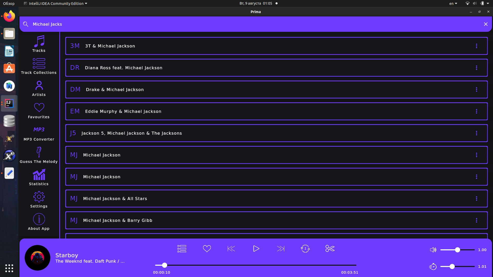
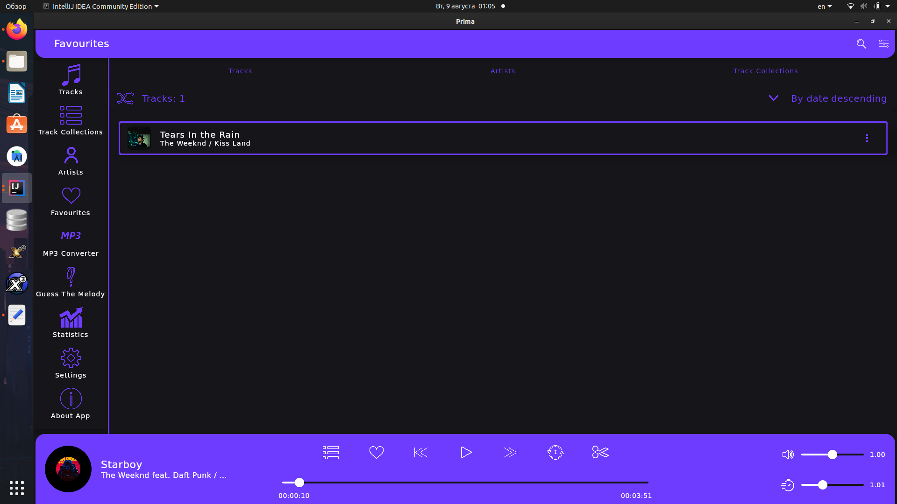

**Prima (PC version)**
------------------------

**Developer**
------------------------
[Paranid5](https://github.com/dinaraparanid)

**Current status**
------------------------
**Alpha V 0.2**

**About App**
------------------------

PC version of Prima music player app

**Download**
------------------------

**Linux:**

1. Download project: https://drive.google.com/drive/folders/1ZaTabzvj8Pq8PY79e9gC-_5N-TINCRfs
2. Run it with *java -jar PrimaPC-linux-x64-1.2.0.jar*

If you are missing Java 17, please, install it with this line:
*sudo apt install openjdk-17-jdk openjdk-17-jre*

**Android Version**: https://github.com/dinaraparanid/PrimaMobile
